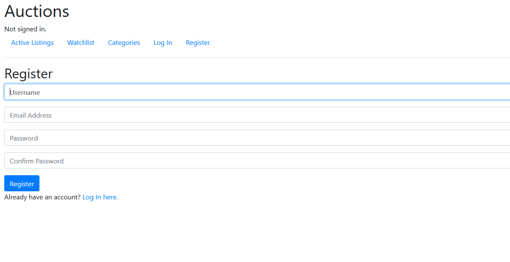
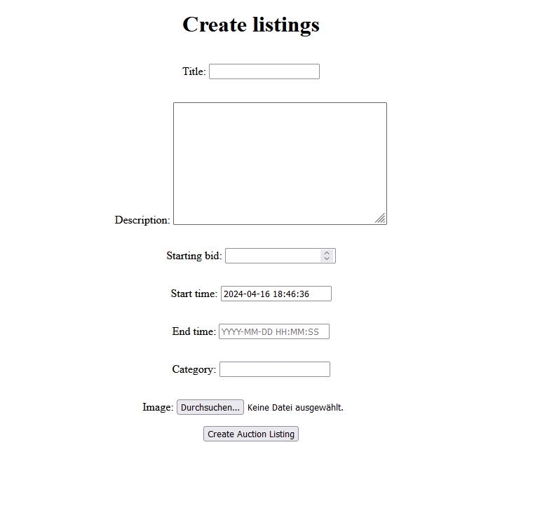
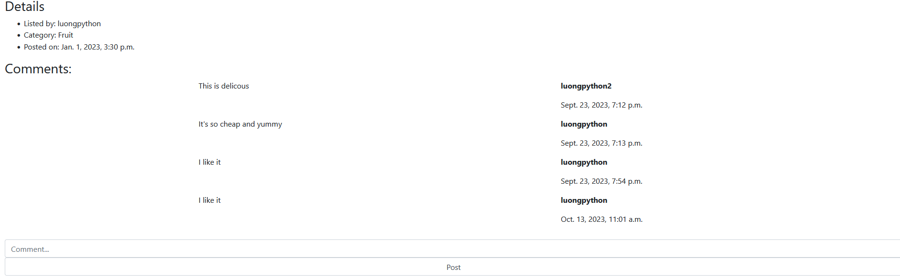
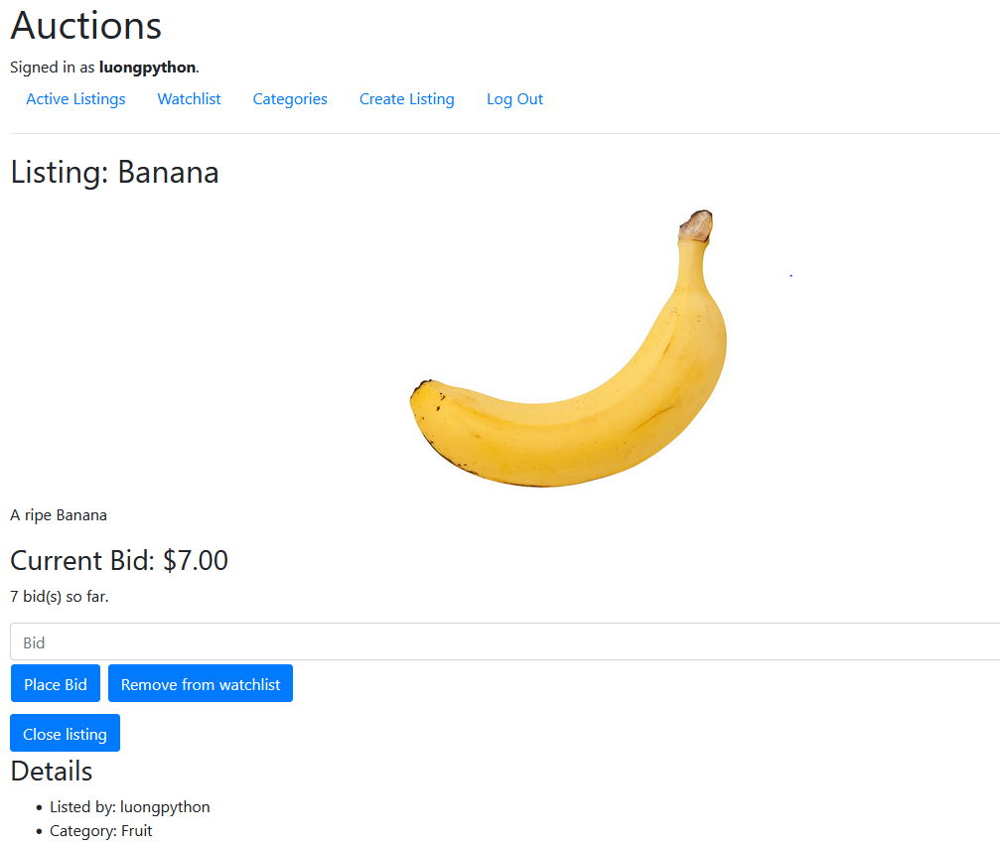
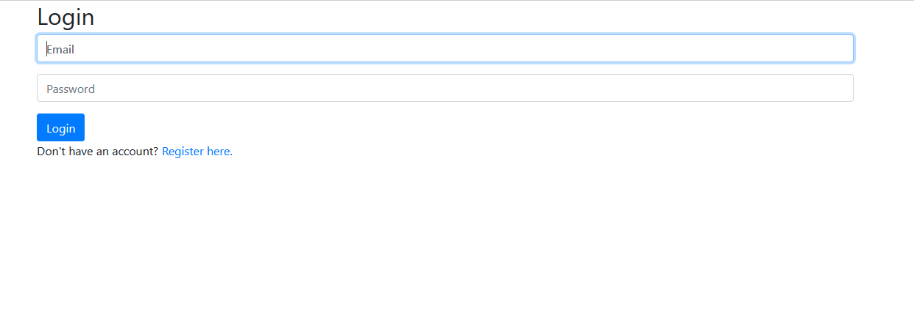
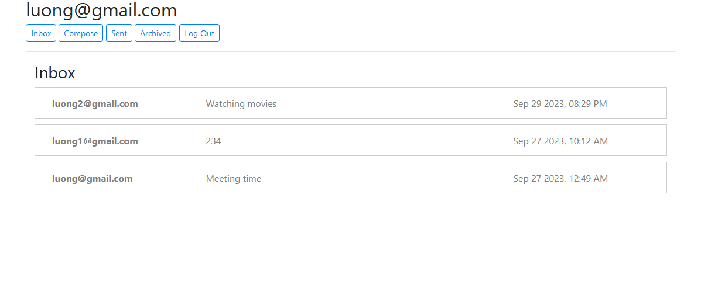
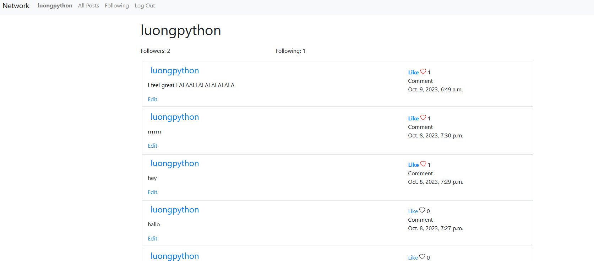

# CS50 Web programming with Python and JavaScript
Projects from the course

## Tech Stack: 
  - Django, HTML, CSS (Bootstrap), JavaScript

## Commerce
- An auction-like web page:
    + _Handling User authentication_
    + _Storing data using Sqlite_
    + _Handling requests and routing_
    + _Things user can do:_
        + Register, Log in, Log out
           
        + Create a listing
           
        + _Make a bid on a listing
        + Make comments on a listing_
           
        + _Add/remove an item to watchlist_
           
        + _Close a listing_
***
## Mail
- An Email-service 1-page-application. Instead of view-based rendering, the page fetchs API from the Django server.
  + _Handling User authentication_
  + _Storing data using Sqlite_
  + _Rendering with vanila javasript ^^__
  + _Things user can do:_
    + Register, Log in, Log out
        
    + Send/receive emails
    + Archive emails
    + Reply to emails  
        
***
## Network
- A social network website.
  + _Handling User authentication_
  + _Storing data using Sqlite_
  + _Rendering with vanila javasript ^^_
  + Users can:
    + Register, Log in, Log out
    + Post something
    + Like/Dislike a post
    + Follow/unfollow other users
      

***
## Wiki
- A wiki-like website:
  ![image](
***
